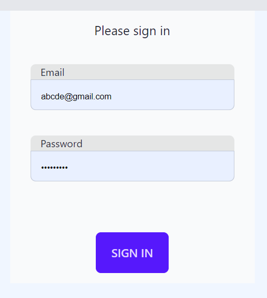
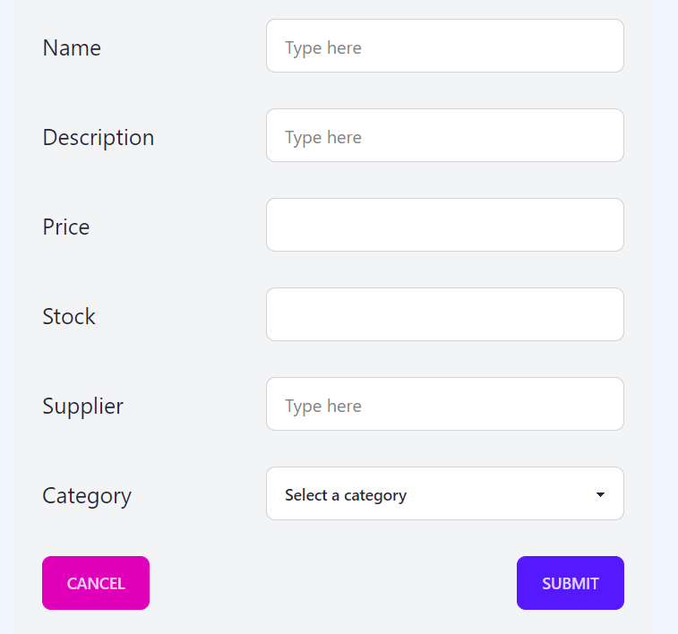
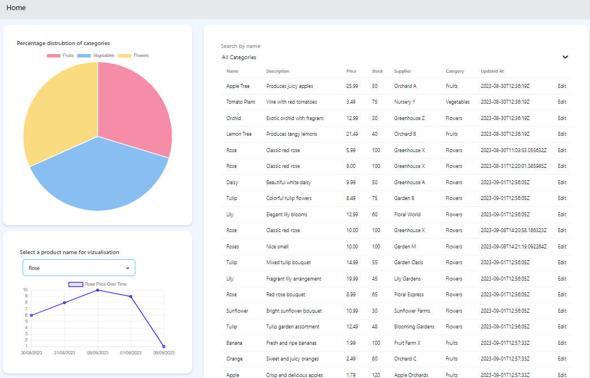
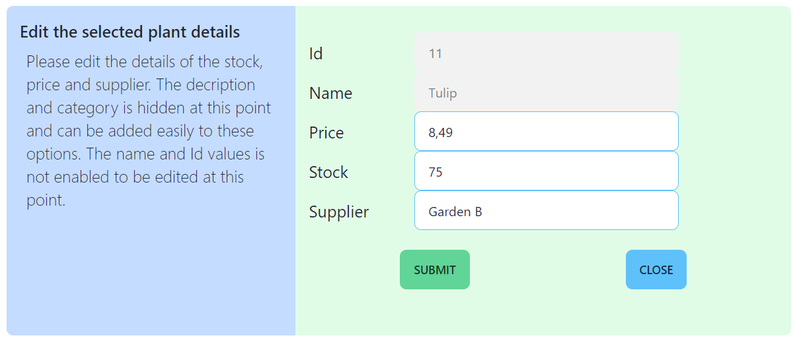

# Project Deployment Instructions

To deploy the entire project, make sure you have the following prerequisites installed:

1. **Git**
2. **Node.js and npm**
3. **MySQL**

## Front End Deployment

### Step 1: Clone the GitHub Repository

```bash
git clone <repository_url>
cd <repository_directory>
```

### Step 2: Install Dependencies

```bash
npm install
```

### Step 3: Start the Next.js Server

```bash
npm run build
npm start
```

The hosted website can be accessed at the URL http://localhost:3000/.

## Project Documentation

The project documentation provides insight into its implementation.

- Every page on the website is accessible only if you are logged in. The login authentication is primarily based on user credentials.

Example images of key pages:

- Login page
  
- Register new input
  
- Home page when logged in



-the editing page for information is presented in tabular format.


The front-end design primarily utilizes Deasyui and Tailwind CSS. Real-time graphs are implemented and will update dynamically based on user interactions and data updates.
